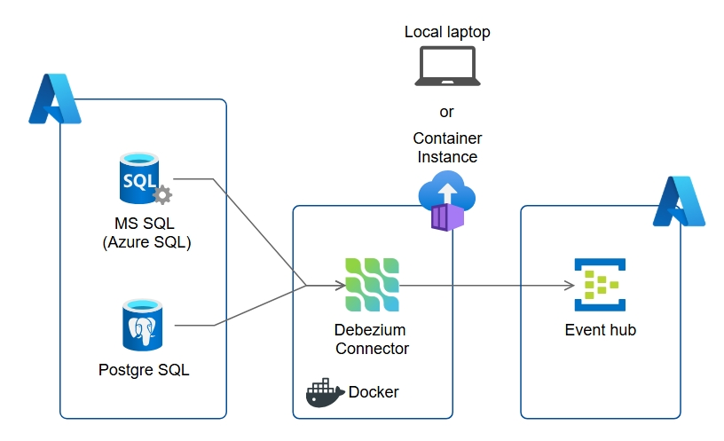

# Streaming data from MSSQL and PostgreSQL using Debezium connector
## Introduction
This repo contains sampel code and configurations to stream data from MSSQL to PostgreSQL database using Debezium.\
Debezium is an open-source platform for change data capture (CDC) that streams real-time database changes (inserts, updates, deletes) to applications and other systems. It works well with kafka connect platform and has the capability to send data to differen kafka sink destinations such as confluenct and Azure eventhub.\
This repo focuses to capture data from both MSSQL and postgreSQL source and sink data to Azure Eventhub using debezium connector. Please refer to the following diagram for hight level architecture.\

## Pre requisit
1. Local environment: 
    * Docker desktop
    * Python 3.19 and above
2. SQL database or PostgreSQL database in Azure. Ensure connectivity to either local development environment or ACI instance
3. Azure event hub with at least standard tier (Basic tier does not work with Debezium connector)
## Setup
1. All the variables such as database hostname, Azure Eventhub host name and authentication details etc are managed in the .evn file. Before executing any code you will need to get those details in the .env file.\
Python scripts and any configuration will load variables from .env to avoid any hardcoded parameters.
2. Create python virtual environment and install required packages from the requirement.txt file
## Simulate database changes(change events)
In the events_simulation folder you will find some python code that you can execute to generate some data that write to either MSSQL or PostgreSQL databaes.\
This setup here is very basic you will need to use connection string for either MSSQL or PostgreSQL at a time by commenting the other one like the following
```
connect_str = 'mssql+pyodbc:///?odbc_connect=' + urllib.parse.quote_plus(odbc_str)
# connect_str = f"postgresql://{env['pg_username']}:{env['pg_password']}@{env['pg_server']}/{env['pg_database']}"
```  
## Deploy Debezium connector
1. Deploy Kafka connect\
Debezium connector is compatible with Kafka connect and deployed to Kafka connect instance. First we will need deploy a Kafka connect instance using docker container.\
In the connectors/kafka_connect folder there is a docker compose file that helps to create docker container that runs locally in docker desktop. It reads variables from the .env file that we have updated earlier. Use the following command to create the container:
```
docker compose -f .\docker-compose.yaml --env-file ..\..\.env up -d
``` 
2. Create debezium connector for MSSQL
Debezium connector is created by calling connect API with connector configuration
In the connectors/mssql folder there are two versions of the connector that has been tried. It's recommended to go with the most recent versions which is 3.1.2.\
If you created kafka connect as a local docker container then the rest API hostname is "localhost". If you are creating the docker container in ACI then you will need to replace the rest API hostname with the ACI hostname or IP.\
Once the connector is create you can use its rest API to inspect the status of the connector.
You can find the code snippet in the script.
**The Catch**
For MSSQL there are some requirement for the topics

